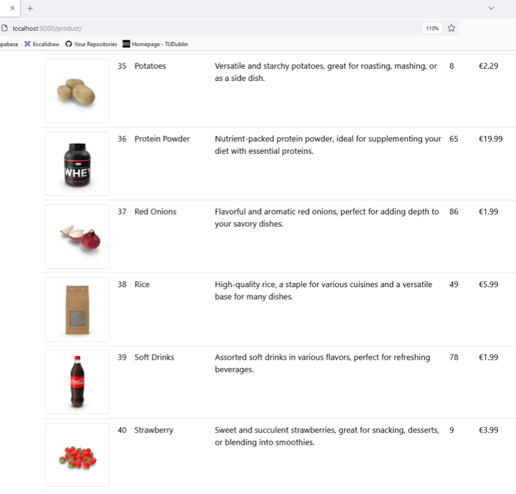

# Lab 5: Products CRUD

### Getting started

**Start by cloning this repository and opening in VS Code.**

1. Configure the Python Virtual Environment

   `python -m venv venv --prompt="lab6"`

2. Activate the Virtual Environment

   `venv\Scripts\activate`

3. Install dependencies

   `pip install fastapi uvicorn jinja2 python-multipart httpx`

4. Setup the `.env` file, e.g. based on `.env.example`

5. To run the application use

   `uvicorn app.main:app --reload --port=5000`

## Introduction

In this lab you will use products data from [dummyjson.com](https://dummyjson.com/products?limit=40&skip=0&select=id,title,description,category,price,rating,stock,brand,sku,thumbnail) to build a web application to manage products. You will add the **CRUD** functions used previous labs to allow users to **c**reate, **r**ead, **u**pdate, and **d**elete products.

After starting the application you should see a new entry, **Products** in the navigation menu which does not work yet - following the link displays an error.

In the **`app`** folder you will find the following:

1. a model class for **`Product`**.

2. **`data access`**  functions, including `dataInitDB()` which populates `products_data` from dummy json when `dataGetProducts()` is accessed for the first time after startup.

3. **`product_service`** functions.

4. **`view_template/product`** contains the product page template.
5. Also see `.env_example` for the dummyjson URL.

## Exercises

1. Add a **route** to handle requests for `/product` by returning the appropriate HTML response.

2. **Display** the full list  of products  in the product page. Use appropriate HTML elements with Bootstrap 5.3 styling. For examples Bootstrap 'cards' or a **Table**. Include the thumbnail images in your page.

   

3. **Add new products** via a form (use  a URL link for the thumbnail image).
4. Implement features to **update** and **delete** products when their edit/ delete buttons are clicked.
5. Make use of **htmx** in your solutions, Make use of **htmx** in your solutions, following the examples from previous labs.
